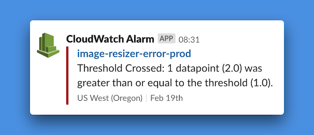

# cloudwatch-alarm-to-slack

Slack bot that maps AWS CloudWatch Alarms into Slack messages.

## Setup

- Clone the repository and run `npm install`
- Ensure your [AWS credentials are available](https://serverless.com/framework/docs/providers/aws/guide/credentials/)
- Configure a Slack [Incoming Webhook](https://slack.com/apps/manage/custom-integrations)
- Deploy with `ENVIRONMENT=your-env DEPLOYMENT_BUCKET=your-bucket npm run deploy`
- Once deployed, configure CloudWatch Alarm Actions to send notifications to the topic this stack creates

## Developing

- Run tests, `npm test`
- Invoke locally, `npm run invoke`
